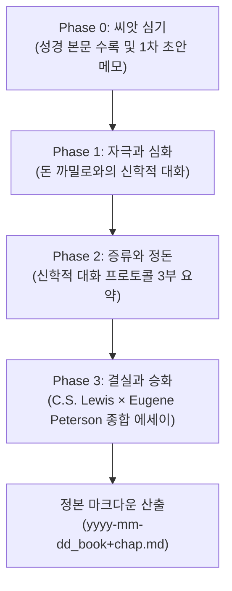

# 📖 성서 묵상 동반자 (Chrome Bible Meditation Companion)

성경 읽기 웹사이트(대한성서공회 등)를 이용하면서 브라우저 우측 사이드 패널(Side Panel)을 통해 **1차 묵상 초안**(씨앗)을 심고, **돈 까밀로**(Don Camillo) 신부와의 가식 없는 대화로 사유를 단련한 뒤, **C.S. Lewis × Eugene Peterson** 문체로 종합된 정본 마크다운 에세이를 수확하는 **4단계 묵상 파이프라인 크롬 확장 프로그램**입니다.

---

## 🌱 4단계 성서 묵상 파이프라인 (The 4-Phase Pipeline)

본 확장 프로그램은 단순한 AI 글쓰기 생성기가 아닙니다. 사용자의 원초적인 묵상이 지적·영적 단련을 거쳐 온전한 신학적 에세이로 만개하도록 돕는 유기적 파이프라인으로 설계되었습니다.

### 1. Phase 0: 씨앗 심기 (본문 수록 및 1차 초안 메모)
- **사유의 출발점**: 웹 브라우저에서 읽은 성경 구절과 함께 책/장(예: `Lev`, `18`)을 지정합니다.
- **날것 그대로의 기록**: 형식이나 문장에 구애받지 않고, 떠오른 거친 생각, 정직한 의문, 감정, 초기 통찰을 자유롭게 메모합니다.
- **역할**: 이 초안은 전체 묵상의 토양이자, 인공지능의 일방적인 개입을 막고 사용자의 고유한 문제의식을 보존하는 **씨앗**(Seed)이 됩니다.

### 2. Phase 1: 자극과 심화 (돈 까밀로와의 신학적 대화)
- **페르소나 기원**: **조반니노 과레스키의 소설 《신부님 신부님 우리들의 신부님》**(Don Camillo) 속 돈 까밀로 신부의 인격을 구현했습니다.
- **상투적 칭찬 배제**: "은혜롭습니다", "믿음이 깊으시네요" 같은 관습적 찬사를 일체 건네지 않습니다.
- **가식 없는 직설적 질문**: 성당 제단의 십자가에 달리신 예수 그리스도와 가식 없이 대화하던 돈 까밀로처럼, 사용자가 신앙적 언어로 얼버무리거나 간과한 본문의 낯선 긴장, 윤리적 딜레마, 실존의 모순을 집요하게 짚어냅니다.
    > "신앙적인 미사여구 뒤로 숨지 마시오. 그 말씀이 오늘 당신의 살과 피, 일상의 구체적인 갈등 앞에서 진짜 무엇을 요구하고 있는지 정직하게 대답해 보시오."
- **턴제 상호작용**: 결론을 일방적으로 단정 짓지 않고, 한 턴에 하나의 날카로운 도전 질문을 던져 사용자가 자신의 언어로 사유를 한 걸음 더 밀고 나가도록 돕습니다.

### 3. Phase 2: 증류와 정돈 (신학적 대화 프로토콜)
- 대화가 끝나면 나눈 생각들이 흩어지지 않도록 사유의 진전 과정을 3가지 핵심 축으로 자동 요약하여 정돈합니다:
  - **초기 통찰과 질문**: 사용자의 1차 초안에 담긴 핵심 사유 요약
  - **돈 까밀로의 도전적 질문**: 텍스트와 실존의 긴장을 파고든 핵심 질문 요약
  - **심화된 통찰과 종합**: 대화를 거치며 한 단계 성숙해진 결론적 통찰 정리

### 4. Phase 3: 결실과 승화 (C.S. Lewis × Eugene Peterson 종합 에세이)
- **1차 초안**(씨앗)과 **대화 프로토콜**(심화된 사유)을 결합하여 품격 높은 완성형 묵상 에세이를 집필합니다.
- **C.S. Lewis의 명료함**: 사변적 현학을 걷어내고 복음의 뼈대를 선명하게 드러내는 단단한 논리와 일상적 비유.
- **Eugene Peterson의 시적 생명력**: 거룩한 종교적 박제어가 아닌, 흙냄새 나는 삶의 현장과 일상 언어(The Message)의 담백함.
- **초대형 관조의 산문**: 소제목이나 '적용 포인트 1, 2, 3', '오늘의 기도' 같은 인위적 구획을 일체 두지 않고, 4~5개의 온전한 문단 속에서 말씀의 거룩한 무게 앞에 정직하게 머물게 합니다.
- **1:1 대구형 제목 (Phrase Title)**: 콜론(:) 사용을 금지하고, 본문의 핵심 제의/사물 요소와 실존적 구속의 만남을 간결하게 압축합니다. (예: `피의 경계와 산 자의 거룩함`)

---

### 📄 최종 산출물: 3부 구성 정본 마크다운

에세이 종합 후 **[마크다운 내보내기]**를 누르면 다음 3부 구성의 정본 파일(`yyyy-mm-dd_book+chap.md`)로 자동 다운로드됩니다:

1. **상단 (씨앗)**: 원문 성경 구절과 사용자의 1차 묵상 초안 메모 원본
2. **중단 (사유의 궤적)**: 3가지 항목으로 정돈된 신학적 대화 프로토콜
3. **하단 (사유의 만개)**: 1:1 대구형 제목을 갖춘 완성 묵상 산문 에세이

자세한 페르소나 설계 철학과 문학적 배경은 **[AI 페르소나 안내 (PERSONAS.md)](PERSONAS.md)**를 참조하십시오.

---

## ✨ 시스템 및 기술 특징

1. **원페이지 스크롤형 사이드 패널 (Chrome Side Panel API)**
   - 브라우저 우측에 도킹되어 웹 서핑이나 성경 본문 읽기 탭과 나란히 작업할 수 있습니다.
   - 씨앗 심기 ➔ 대화 ➔ 프로토콜 및 에세이 종합 ➔ 내보내기가 단일 스크롤 캔버스로 매끄럽게 이어집니다.
2. **트리플 AI 엔진 지원 (Multi-Provider 라인업)**
   - **Google Gemini**:
     1. `gemini-3.8-flash` (1순위 권장, 100% 무료 티어, High Reasoning)
     2. `gemini-3.7-flash` (High Reasoning)
     3. `gemini-3.1-pro-preview`
   - **Anthropic Claude**:
     1. `claude-sonnet-5` (1순위 권장, 최고 수준 문학적 사유)
     2. `claude-opus-5`
   - **OpenAI**:
     1. `gpt-5.6-luna-max` (1순위 권장, 고성능/가성비)
     2. `gpt-5.6-sol` (Medium Reasoning)
     3. `gpt-6-astra` (Low Reasoning)
   - 상단 헤더 배지 클릭 한 번으로 엔진 및 모델을 자유롭게 전환할 수 있습니다.
3. **엄격한 마크다운 린트 무결성 검증**
   - 가독성과 조사 렌더링 무결성을 위해 이탤릭 서식(`*text*`, `_text_`) 일체 배제
   - 엠대시(`—`, `–`) 배제 및 자연스러운 문장 분리
   - 로컬 시간 기준 날짜(`getLocalIsoDate`) 및 안전한 파일명 정제(`sanitizeFilenamePart`)
   - 인라인 스크립트 및 XSS 공격 위험 태그 차단

---

## 🛠️ 설치 및 사용 방법

### 1. Chrome에 확장 프로그램 로드
1. 크롬 브라우저의 `chrome://extensions` 페이지로 이동합니다.
2. 우측 상단의 **[개발자 모드]**를 활성화합니다.
3. **[압축해제된 확장 프로그램을 로드합니다]**를 누르고 본 프로젝트 폴더를 선택합니다. (이미 로드된 경우 새로고침 🔄 아이콘 클릭)

### 2. AI 엔진 및 API 키 설정 (BYOK)
1. 브라우저 툴바의 **[성서 묵상 패널 열기]** 아이콘을 클릭합니다.
2. 사이드 패널 상단의 **모델 배지** 또는 **설정(⚙️)** 버튼을 누릅니다.
3. 원하는 기본 AI 엔진을 선택하고 보유한 API 키를 입력합니다:
   - **Google Gemini**: [Google AI Studio](https://aistudio.google.com/apikey)에서 무료 키(`AIzaSy...`) 발급 후 입력 (새 프로젝트 만들기 선택 시 100% 무료 티어)
   - **Anthropic Claude**: [Anthropic Console](https://console.anthropic.com/settings/keys)에서 API 키(`sk-ant-...`) 발급 후 입력
   - **OpenAI**: [OpenAI Platform](https://platform.openai.com/api-keys)에서 API 키(`sk-...`) 발급 후 입력
   - 각 사별 상세 키 발급 절차 및 무료 설정 팁은 **[API 키 발급 가이드 (API_KEYS.md)](API_KEYS.md)**를 참조하십시오.
4. **[저장하기]**를 누르면 즉시 설정이 반영됩니다.
5. 본문 구절과 1차 초안 메모를 입력한 뒤 **[🎭 돈 까밀로와 대화 시작]**을 눌러 묵상을 시작합니다.

---

## 🔒 보안 및 개인정보 보호 (BYOK)

- **개발자 서버 Zero**: 본 확장 프로그램은 중앙 서버나 프록시가 전혀 없으며, 사용자의 API 키와 묵상 본문은 오직 사용자가 선택한 AI 공급자의 공식 API 엔드포인트로만 직접 암호화 전송됩니다.
- **저장소 정책**: 기본적으로 브라우저 종료 시 키가 메모리에서 자동 소멸(`chrome.storage.session`)되며, 사용자가 명시적으로 체크한 경우에만 로컬 브라우저 프로필(`chrome.storage.local`)에 저장됩니다.
- **권한 최소화**: 외부 파일 시스템 접근이나 불필요한 권한을 요구하지 않으며, 오직 `sidePanel`과 `storage` 권한만 사용합니다. (다운로드는 인라인 Blob 방식으로 처리하여 `downloads` 권한조차 배제함)

---

## 📄 문서 및 라이선스

- **API 키 발급 안내**: [API 키 발급 가이드 (API_KEYS.md)](API_KEYS.md)
- **페르소나 설계 철학**: [AI 페르소나 안내 (PERSONAS.md)](PERSONAS.md)
- **개인정보 처리방침**: [개인정보 처리방침 (PRIVACY.md)](PRIVACY.md)
- **보안 정책**: [보안 정책 (SECURITY.md)](SECURITY.md)
- **기여 가이드**: [기여 방법 안내 (CONTRIBUTING.md)](CONTRIBUTING.md)
- **라이선스**: [MIT License](LICENSE)
